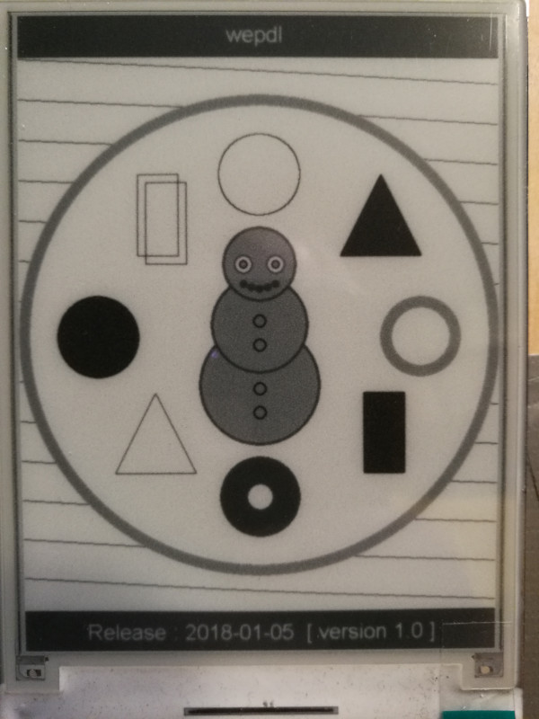

# wepdl (Waveshare Electronic Paper Display Library)
(repository transfered from old account - tmseth)

wepdl currently support only UART display 4.3 inch (800x600 px). This library requires no other dependencies, has been simplified at the same time it has more options (like pin addressing in the project code instead of the library).

All informations on Wiki page : [https://github.com/8tm/wepdl/wiki]

---

## Running the tests

Select menu File -> Examples -> wepdl -> (some example)

1) Connect your device (Arduino, Nodemcu, etc) to computer.

2) Choice USB port.

3) In Arduino-IDE use combination CTRL + U to compile and upload sketch.

4) Wait a moment :)

---

## Authors

* **Tadeusz Miszczyk** - *This EPD library*
* **Waveshare** - *Initial work with oryginal EPD library*

---

## Waveshare

Website : [https://www.waveshare.com](https://www.waveshare.com)

E-mail : [service@waveshare.com](mailto:service@waveshare.com)

---

Waveshare demo video on YouTube : [https://www.youtube.com/watch?v=06rDuQzYovk](https://www.youtube.com/watch?v=06rDuQzYovk)

Waveshare 4.3" e-paper display UART module : [https://www.waveshare.com/4.3inch-e-paper.htm](https://www.waveshare.com/4.3inch-e-paper.htm) (800x600 px, 4 color)

Wiki :  [https://www.waveshare.com/wiki/4.3inch_e-Paper_UART_Module](https://www.waveshare.com/wiki/4.3inch_e-Paper_UART_Module)

Datasheets of parts : [https://www.waveshare.com/wiki/4.3inch_e-Paper_Datasheets](https://www.waveshare.com/wiki/4.3inch_e-Paper_Datasheets)

Oryginal library : [https://www.waveshare.com/w/upload/archive/e/eb/20171228082252%214.3inch-e-Paper-Code.7z](https://www.waveshare.com/w/upload/archive/e/eb/20171228082252%214.3inch-e-Paper-Code.7z)

User manual : [https://www.waveshare.com/wiki/File:4.3inch-e-Paper-UserManual.pdf](https://www.waveshare.com/wiki/File:4.3inch-e-Paper-UserManual.pdf)

---

## License

This project is licensed under the GNU General Public License v3.0 - see the [LICENSE](LICENSE) file for details

---

## Acknowledgments

* Inspiration : Life

---
